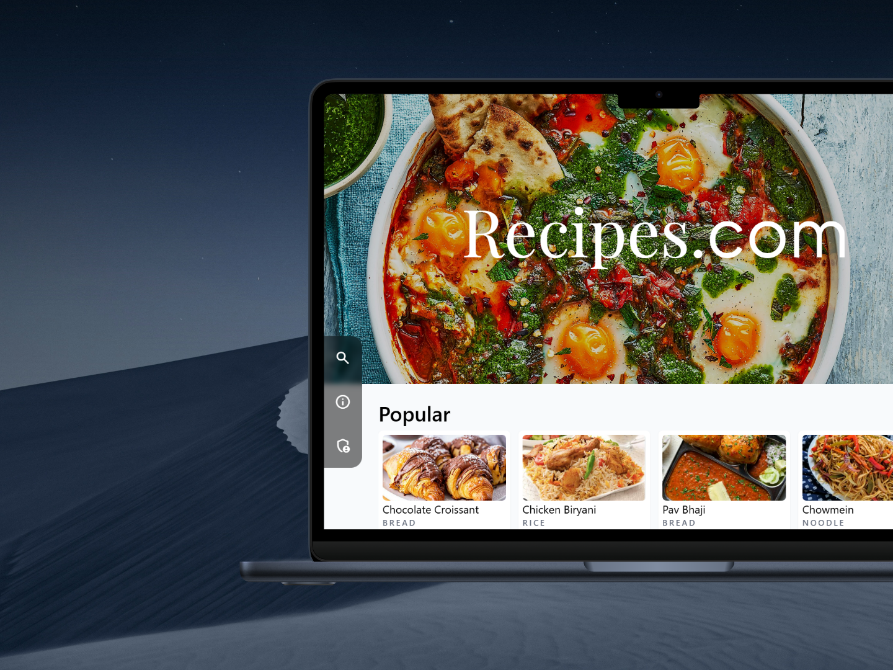

# Recipes.com

### A mock recipe website with fully functional frontend and backend

Backend written in Python/Flask
Frontend written in Next.js/TailwindCSS

# Install

```sh
pnpm install

# Ubuntu
# sudo apt-get install python3-poetry

# Windows
# python -m pip install poetry

# Mac
# python -m pip install poetry

poetry install
```

# Configuration

Copy `backend/.env.example` into the folder's `.env` and edit the variables as needed

```
# Data storage directory for images
# RECIPES_BACKEND_PUBLIC_DIRECTORY=public_data
# RECIPES_BACKEND_IMAGE_API_BASE_URL=http://host:port

# Database configuration
# RECIPES_BACKEND_DB_TYPE=mysql
# RECIPES_BACKEND_DB_HOST=localhost
# RECIPES_BACKEND_DB_PORT=3306
# RECIPES_BACKEND_DB_NAME=recipes_db
# RECIPES_BACKEND_DB_USER=root
# RECIPES_BACKEND_DB_PASSWORD=<password>

# Password for admin page api
# RECIPES_BACKEND_PASSWORD=

# ArliAI API Key
# ARLIAI_API_KEY=<api key>
```

`DB_TYPE` can be `mysql` or `mariadb`

the image api base url is the URL used for fetching images from the client and should point to the backend server instance from an outside POV without trailing forward slash

Copy `frontend/recipescom/.exampleenv` into the respective folder's `.env`

```
# NEXT_PUBLIC_API_BASE="https://<host>:<port>"
```

API Base should point to the backend server instance from a client POV without trailing forward slash.

# Development Run

In a terminal window:

```sh
pnpm dev
```

# Production Build and Run

## Building the frontend

```sh
pnpm build
```

## Running the production builds

_term1_

```sh
npx next start  # or other production servers for next js
```

_term2_

```sh
poetry run waitress-serve --host localhost --port 9422 "recipes_backend_server:app"
# or other production servers for Flask, 9422 is the recommended port, change localhost to
# the host you wish to run the service on. It is recommended to form a reverse proxy setup.
```

# Screenshots

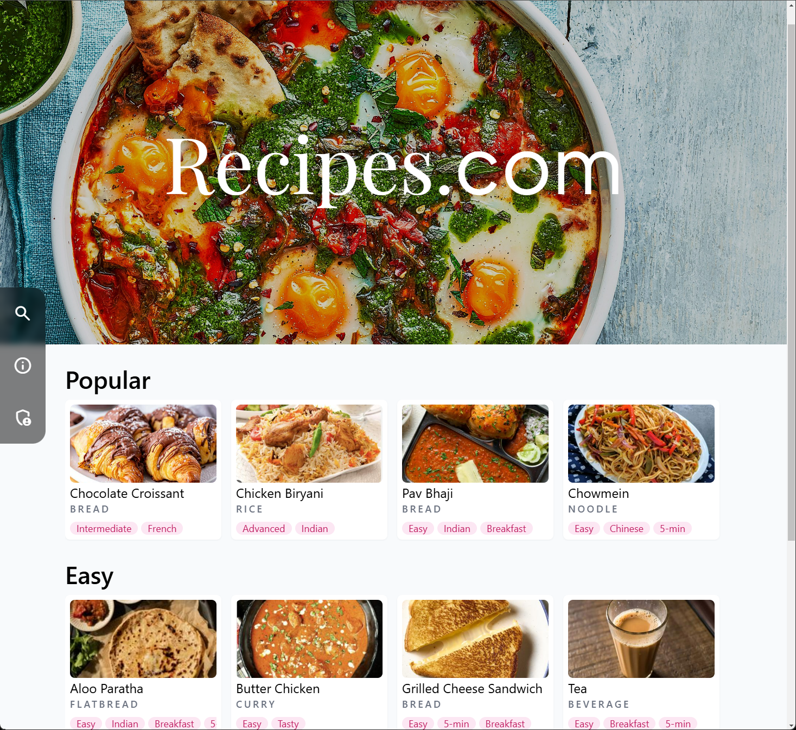
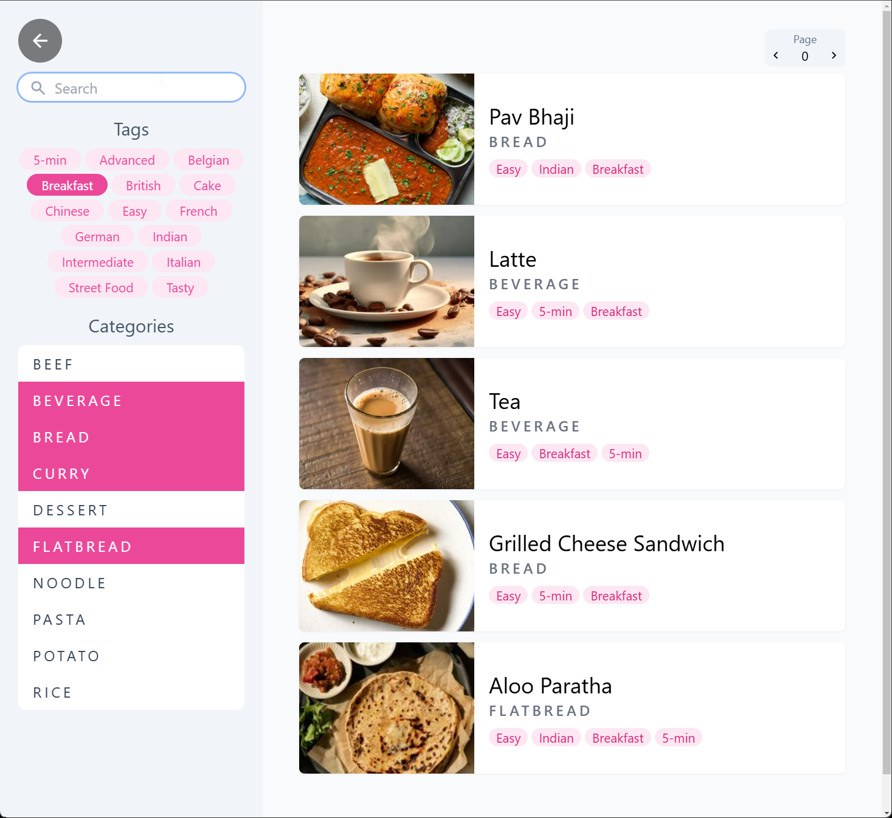
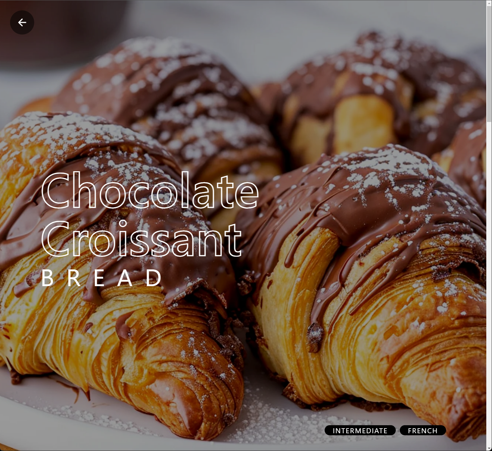
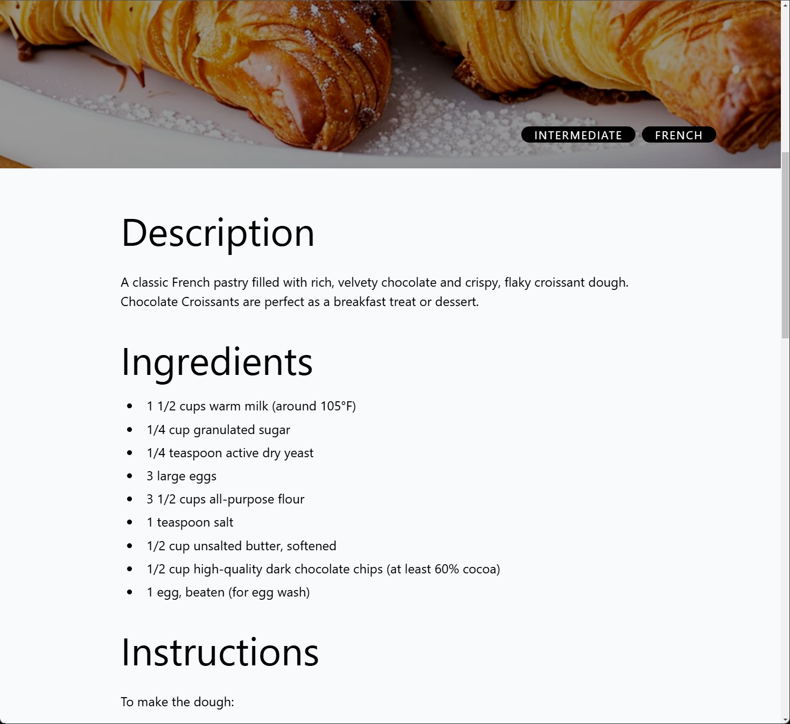
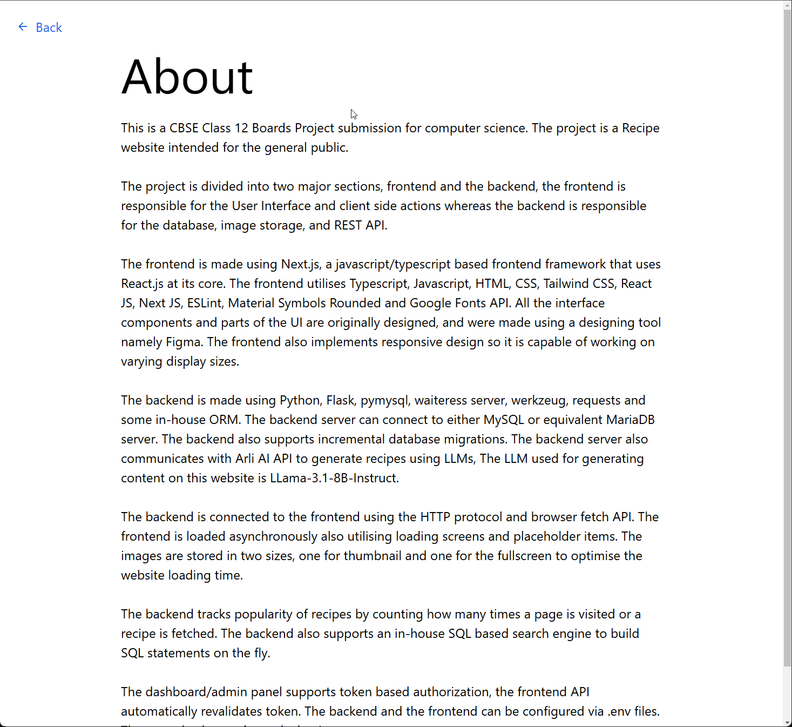
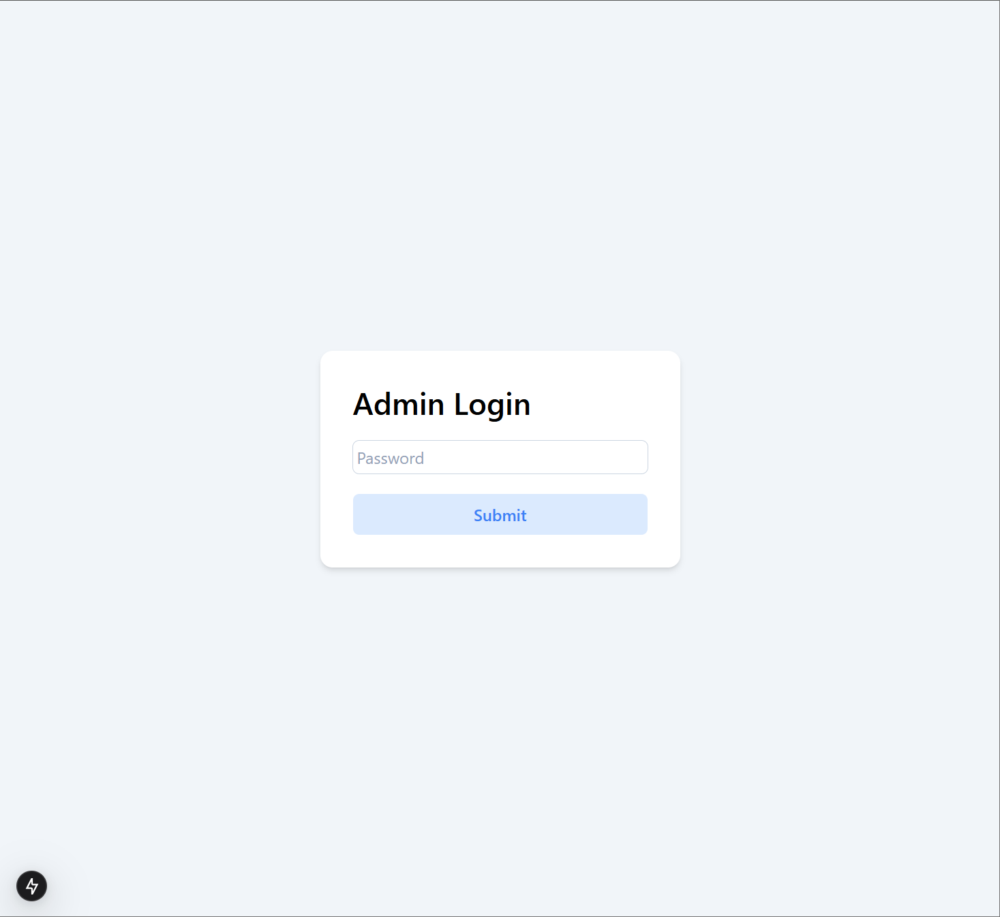
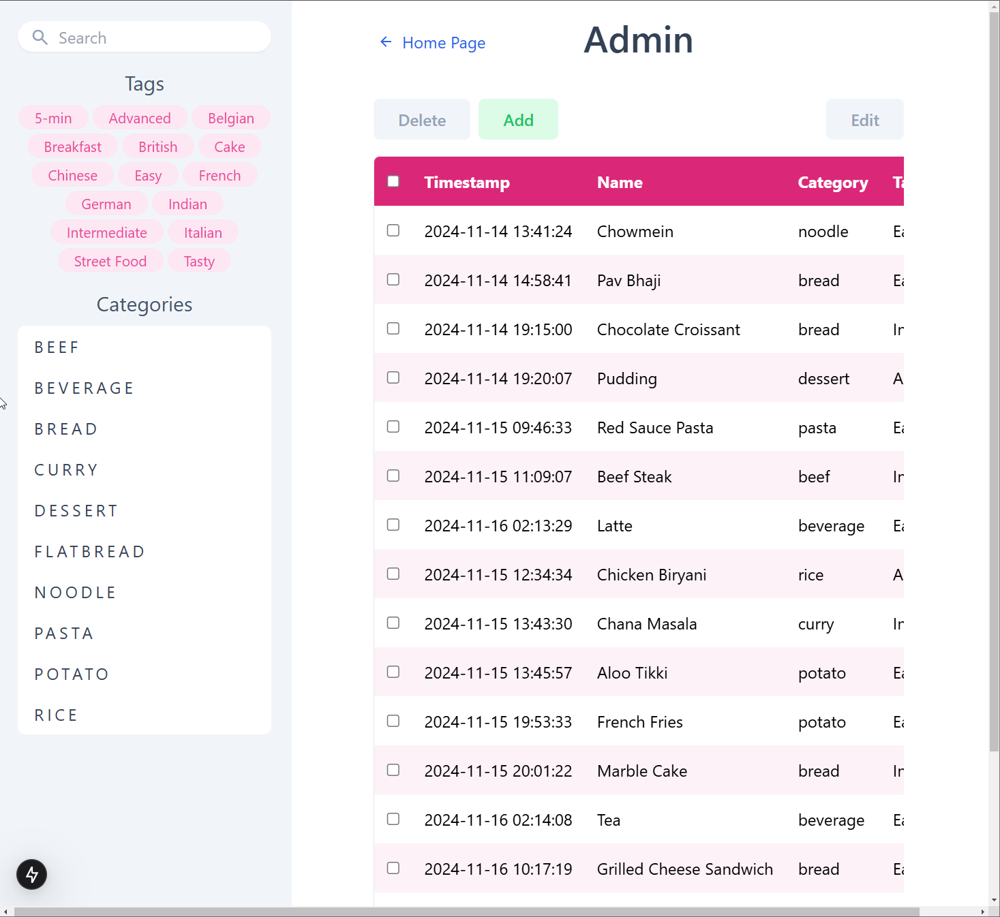
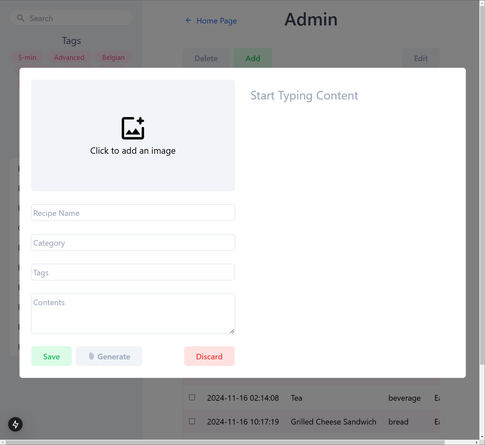
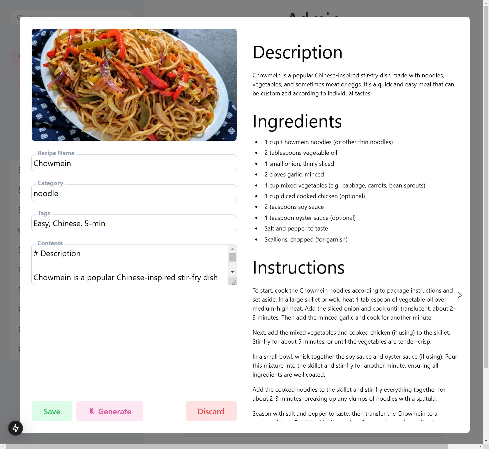
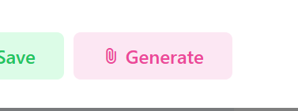
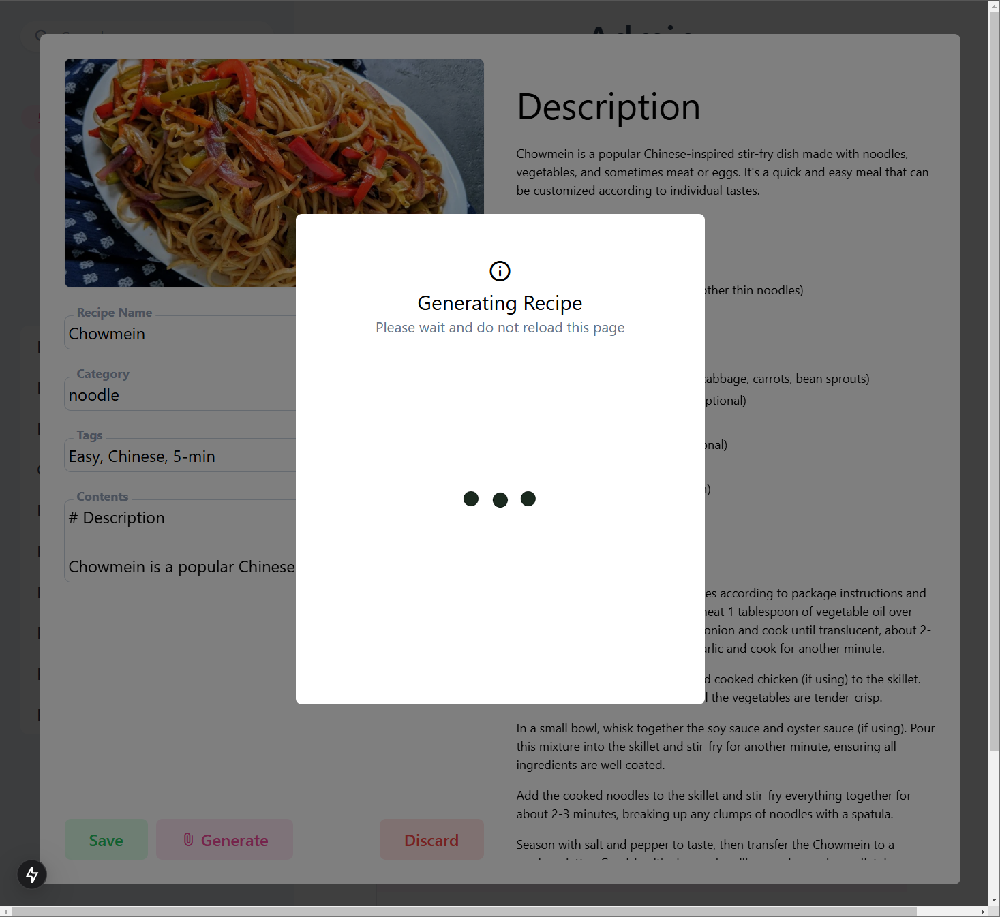
